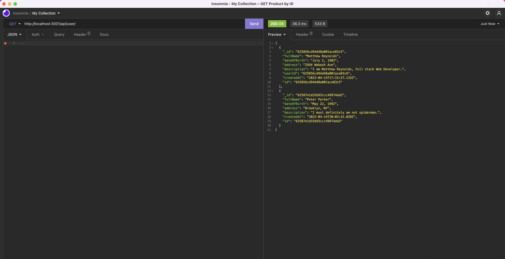
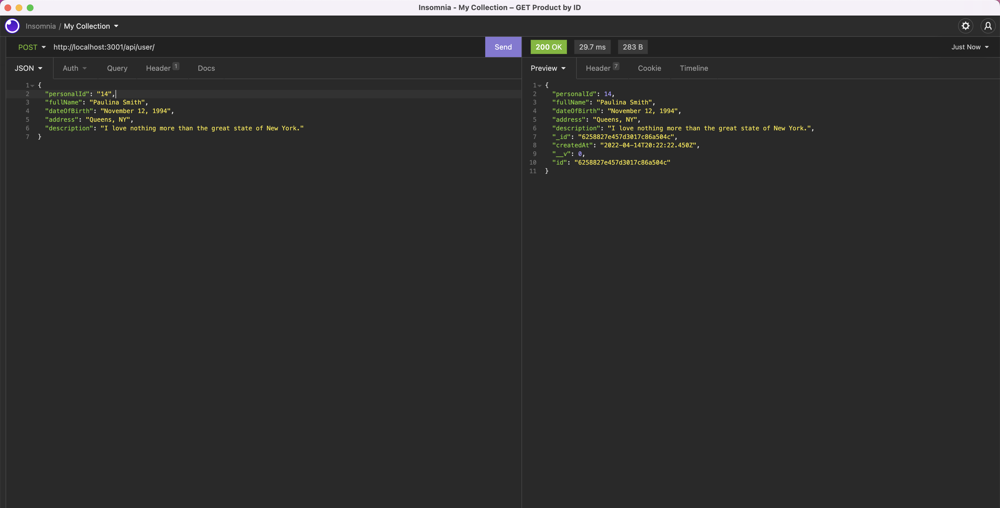
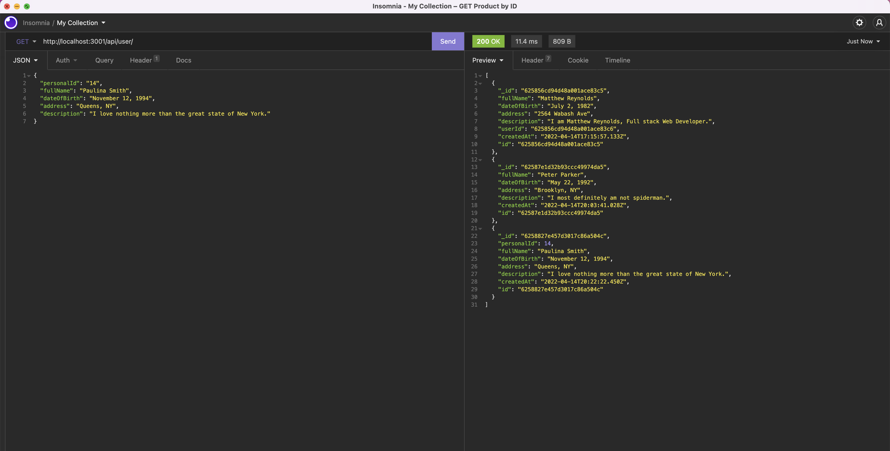
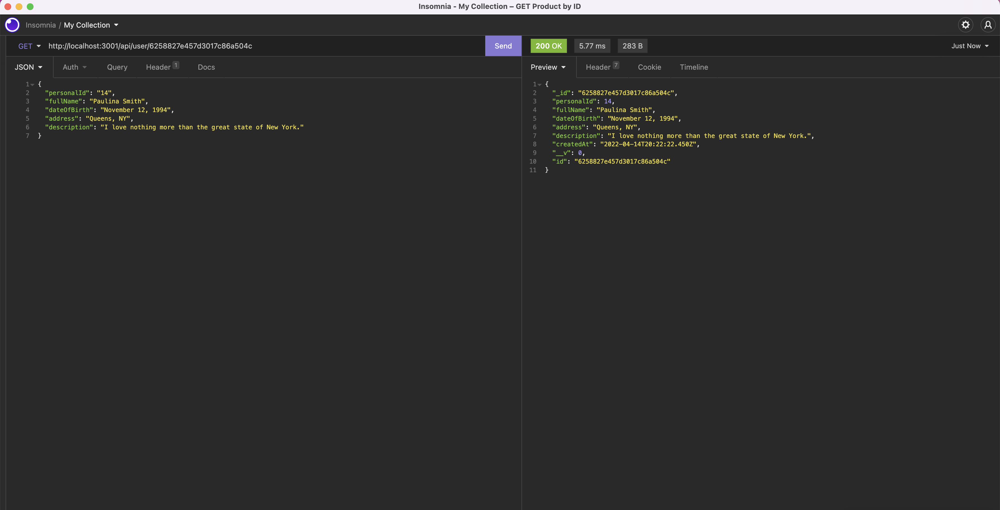
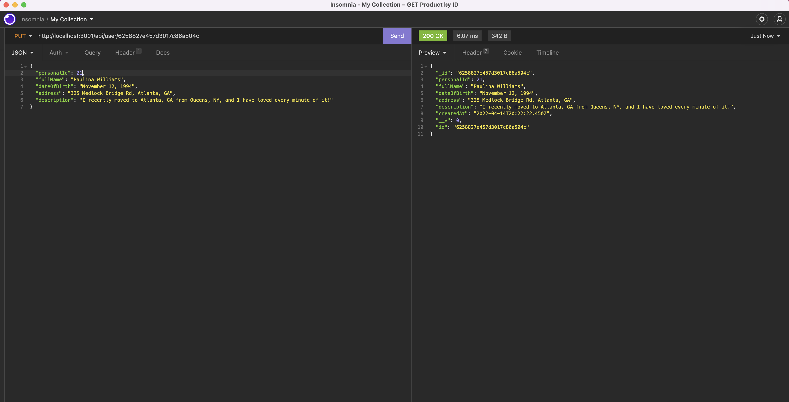
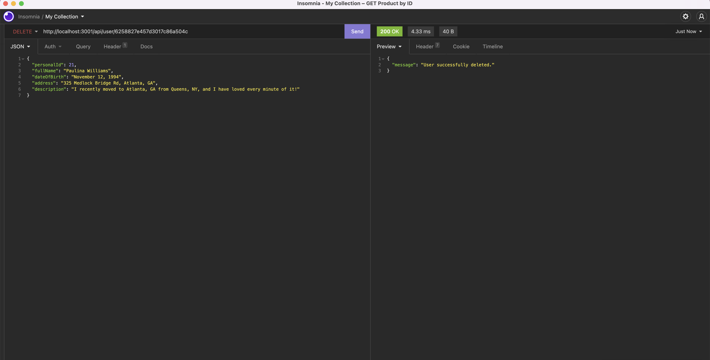

# React Portfolio

## Table of Contents

<a href="#description">Description</a>

<a href="#installation">Installation</a>

<a href="#usage">Usage</a>

<a href="#license">License</a>

<a href="#questions">Questions</a>

## Description

For this applicaiton, I created a RESTful API that can get/create/update/delete user data from a persistence database. The database sotes information about a user such as his or her full name, date of birth, address, personal ID number, and personal description. Upon creating an instance of a individual in the database, the user can then manipulate that information however he or she pleases.

## Installation

When the user opens this application, he or she can enter 'npm i' to install the necessary dependencies. Then the user can enter 'npm run dev' to open a live server that will adjust whenever changes are amde to the code to avoid having to stop and start the server each time a change is made.

## Usage

When exploring this application, users can navigate throughout the database through various endpoints. If a user enters 'npm run dev' in the integrated terminal, he or she can then access the endpoints through an application like Insomnia in order to get/create/update/delete users in the database.

## License

This application is covered under the MIT license.

## Questions

<a href="https://github.com/MattReynolds53">View My GitHub Profile</a>

If you have further questions, please feel free to email me at mattreynolds53@gmail.com at an appropriate time.

## Links

GitHub Repository Link: https://github.com/MattReynolds53/Sagiss-Coding-Challenge

Video Demo Link: Click 'Download' upon reaching the video at https://drive.google.com/file/d/1luxKhmiMG0_Qmlt3-ZPvx8WJD5nIJgRu/view

## Screenshots

